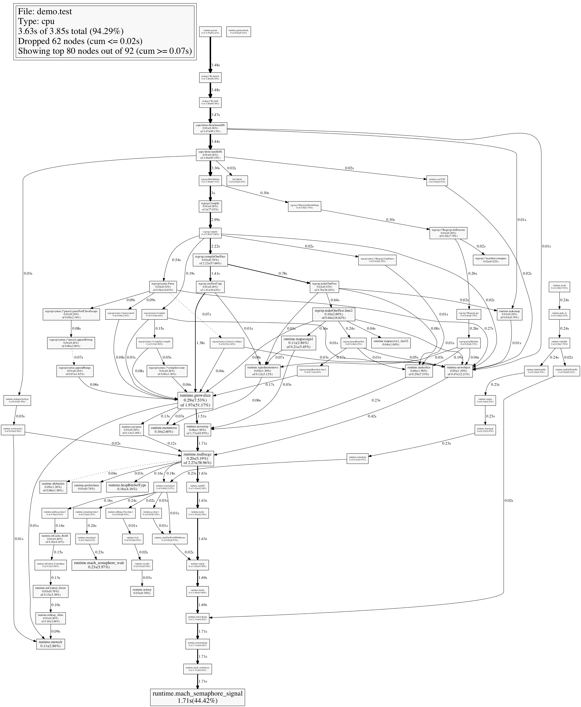

# Profiling & Optimizing in Go

Brad Fitzpatrick

YAPC::Asia 2015

Tokyo Big Sight, 2015-08-22

See the [intro slides](https://goo.gl/PYpNXT).

Watch the [video recording of this talk](http://yapcasia.org/2015/talk/show/6bde6c69-187a-11e5-aca1-525412004261).

## Requirements

If you're following along at home, you'll need the following:

* Go (1.4.2 or 1.5+ recommended)
* Graphviz (http://www.graphviz.org/)
* Linux (ideal), Windows, or OS X (requires [pprof_mac_fix](http://godoc.org/rsc.io/pprof_mac_fix))

## Starting program.

Let's debug and optimize a simple HTTP server.

```go
package main

import (
        "fmt"
        "log"
        "net/http"
        "regexp"
)

var visitors int

func handleHi(w http.ResponseWriter, r *http.Request) {
        if match, _ := regexp.MatchString(`^\w*$`, r.FormValue("color")); !match {
                http.Error(w, "Optional color is invalid", http.StatusBadRequest)
                return
        }
        visitors++
        w.Header().Set("Content-Type", "text/html; charset=utf-8")
        w.Write([]byte("<h1 style='color: " + r.FormValue("color") +
             "'>Welcome!</h1>You are visitor number " + fmt.Sprint(visitors) + "!"))
}

func main() {
        log.Printf("Starting on port 8080")
        http.HandleFunc("/hi", handleHi)
        log.Fatal(http.ListenAndServe("127.0.0.1:8080", nil))
}
```

### Run it.

```
$ cd $GOPATH/src/github.com/bradfitz/talk-yapc-asia-2015/demo
$ go run demo.go
or
$ go build && ./demo
or
$ go install && demo
```

### Testing

```
$ go test
?       yapc/demo       [no test files]
```

Uh oh. No tests. Let's write some.

In `demo_test.go`:

```go
package demo

import (
        "bufio"
        "net/http"
        "net/http/httptest"
        "strings"
        "testing"
)

func TestHandleRoot_Recorder(t *testing.T) {
        rw := httptest.NewRecorder()
        handleHi(rw, req(t, "GET / HTTP/1.0\r\n\r\n"))
        if !strings.Contains(rw.Body.String(), "visitor number") {
                t.Errorf("Unexpected output: %s", rw.Body)
        }
}

func req(t *testing.T, v string) *http.Request {
        req, err := http.ReadRequest(bufio.NewReader(strings.NewReader(v)))
        if err != nil {
                t.Fatal(err)
        }
        return req
}
```

Now:

```
$ go test -v
=== RUN   TestHandleHi_Recorder
--- PASS: TestHandleHi_Recorder (0.00s)
PASS
ok      yapc/demo       0.053s

```

This tests the HTTP handler with a simple in-memory implementation of
the `ResponseWriter` interface.

Another way to write an HTTP test is to use the actual HTTP client &
server, but with automatically created localhost addresses, using the
`httptest` pacakge:

```go
func TestHandleHi_TestServer(t *testing.T) {
        ts := httptest.NewServer(http.HandlerFunc(handleHi))
        defer ts.Close()
        res, err := http.Get(ts.URL)
        if err != nil {
                t.Error(err)
                return
        }
	if g, w := res.Header.Get("Content-Type"), "text/html; charset=utf-8"; g != w {
		t.Errorf("Content-Type = %q; want %q", g, w)
	}
        slurp, err := ioutil.ReadAll(res.Body)
        defer res.Body.Close()
        if err != nil {
                t.Error(err)
                return
        }
        t.Logf("Got: %s", slurp)
}
```

## Race detector.

Go has concurrency built-in to the language and automatically
parallelizes code as necessary over any available CPUs. Unlike Rust,
in Go you can write code with a data race if you're not careful. A
data race is when multiple goroutine access shared data concurrently
without synchronization, when at least one of the gouroutines is doing
a write.

Before we optimize our code, let's ensure we have no data races.

Just run your tests with the `-race` flag:

```
$ go test -race
PASS
ok      yapc/demo       1.047s
```

All good, right?

Nope.

Go's race detector does runtime analysis. It has no false positives,
but it does have false negatives. If it doesn't actually see a race,
it can't report it.

Let's change our test to actually do two things at once:

```go
func TestHandleHi_TestServer_Parallel(t *testing.T) {
	ts := httptest.NewServer(http.HandlerFunc(handleHi))
	defer ts.Close()
	var wg sync.WaitGroup
	for i := 0; i < 2; i++ {
		wg.Add(1)
		go func() {
			defer wg.Done()
			res, err := http.Get(ts.URL)
			if err != nil {
				t.Error(err)
				return
			}
			if g, w := res.Header.Get("Content-Type"), "text/html; charset=utf-8"; g != w {
				t.Errorf("Content-Type = %q; want %q", g, w)
			}
			slurp, err := ioutil.ReadAll(res.Body)
			defer res.Body.Close()
			if err != nil {
				t.Error(err)
				return
			}
			t.Logf("Got: %s", slurp)
		}()
	}
	wg.Wait()
}
```

Now we can run it again and see:

```
$ go test -v -race
=== RUN   TestHandleHi_Recorder
--- PASS: TestHandleHi_Recorder (0.00s)
=== RUN   TestHandleHi_TestServer
--- PASS: TestHandleHi_TestServer (0.00s)
        demo_test.go:46: Got: <h1 style='color: '>Welcome!</h1>You are visitor number 2!
=== RUN   TestHandleHi_TestServer_Parallel
==================
WARNING: DATA RACE
Read by goroutine 21:
  yapc/demo.handleHi()
      /Users/bradfitz/src/yapc/demo/demo.go:17 +0xf5
  net/http.HandlerFunc.ServeHTTP()
      /Users/bradfitz/go/src/net/http/server.go:1422 +0x47
  net/http/httptest.(*waitGroupHandler).ServeHTTP()
      /Users/bradfitz/go/src/net/http/httptest/server.go:200 +0xfe
  net/http.serverHandler.ServeHTTP()
      /Users/bradfitz/go/src/net/http/server.go:1862 +0x206
  net/http.(*conn).serve()
      /Users/bradfitz/go/src/net/http/server.go:1361 +0x117c

Previous write by goroutine 23:
  yapc/demo.handleHi()
      /Users/bradfitz/src/yapc/demo/demo.go:17 +0x111
  net/http.HandlerFunc.ServeHTTP()
      /Users/bradfitz/go/src/net/http/server.go:1422 +0x47
  net/http/httptest.(*waitGroupHandler).ServeHTTP()
      /Users/bradfitz/go/src/net/http/httptest/server.go:200 +0xfe
  net/http.serverHandler.ServeHTTP()
      /Users/bradfitz/go/src/net/http/server.go:1862 +0x206
  net/http.(*conn).serve()
      /Users/bradfitz/go/src/net/http/server.go:1361 +0x117c

Goroutine 21 (running) created at:
  net/http.(*Server).Serve()
      /Users/bradfitz/go/src/net/http/server.go:1912 +0x464

Goroutine 23 (running) created at:
  net/http.(*Server).Serve()
      /Users/bradfitz/go/src/net/http/server.go:1912 +0x464
==================
--- PASS: TestHandleHi_TestServer_Parallel (0.00s)
        demo_test.go:68: Got: <h1 style='color: '>Welcome!</h1>You are visitor number 3!
        demo_test.go:68: Got: <h1 style='color: '>Welcome!</h1>You are visitor number 4!
PASS
Found 1 data race(s)
exit status 66
FAIL    yapc/demo       1.056s
```

Now we can see that the write on line 17 (to the `visitors` variable)
conflicts with the read on line 17 (of the same variable). To make it
more obvious, change the code to:

```go
    now := visitors + 1
    visitors = now
```

... and it'll report different line numbers for each.

## Fix the race!

If your code has data races, all bets are off and you're just waiting
for a crash. The runtime promises nothing if you have a data race.

Multiple options:

* use channels ("Do not communicate by sharing memory; instead, share memory by communicating.")
* use a Mutex
* use atomic

### Mutex

```go
  var visitors struct {
    sync.Mutex
    n int
  }
...
  func foo() {
    ...
    visitors.Lock()
    visitors.n++
    yourVisitorNumber := visitors.n
    visitors.Unlock()
```

### Atomic

```go
  var visitors int64 // must be accessed atomically
...
  func foo() {
    ...
    visitNum := atomic.AddInt64(&visitors, 1)
```

## How fast can it go? CPU Profiling!

To use Go's CPU profiling, it's easiest to first write a `Benchmark`
function, which is very similar to a `Test` function.

```go
func BenchmarkHi(b *testing.B) {
        b.ReportAllocs()
        r := req(b, "GET / HTTP/1.0\r\n\r\n")
        for i := 0; i < b.N; i++ {
                rw := httptest.NewRecorder()
                handleHi(rw, r)
        }
}
```

(and change `func req` to take the `testing.TB` interface instead, so
it can take a `*testing.T` or a `*testing.B`)

Now we can run the benchmarks:

```
$ go test -v -run=^$ -bench=. 
PASS
BenchmarkHi-4     100000             12843 ns/op
ok      yapc/demo       1.472s
```

Play with flags, like `-benchtime`.

Is that fast? Slow? Your decision.

But let's see where the CPU is going now....

## CPU Profiling

```
$ go test -v -run=^$ -bench=^BenchmarkHi$ -benchtime=2s -cpuprofile=prof.cpu
```

(Leaves `demo.test` binary behind)

Now, let's use the Go profile viewer:

```
$ go tool pprof demo.test prof.cpu
Entering interactive mode (type "help" for commands)

(pprof) top 
3070ms of 3850ms total (79.74%)
Dropped 62 nodes (cum <= 19.25ms)
Showing top 10 nodes out of 92 (cum >= 290ms)
      flat  flat%   sum%        cum   cum%
    1710ms 44.42% 44.42%     1710ms 44.42%  runtime.mach_semaphore_signal
     290ms  7.53% 51.95%     1970ms 51.17%  runtime.growslice
     230ms  5.97% 57.92%      230ms  5.97%  runtime.mach_semaphore_wait
     200ms  5.19% 63.12%     2270ms 58.96%  runtime.mallocgc
     160ms  4.16% 67.27%      160ms  4.16%  runtime.heapBitsSetType
     110ms  2.86% 70.13%      210ms  5.45%  runtime.mapassign1
     110ms  2.86% 72.99%      110ms  2.86%  runtime.memclr
     100ms  2.60% 75.58%      640ms 16.62%  regexp.makeOnePass.func2
     100ms  2.60% 78.18%      100ms  2.60%  runtime.memmove
      60ms  1.56% 79.74%      290ms  7.53%  runtime.makeslice

(pprof) top --cum
0.26s of 3.85s total ( 6.75%)
Dropped 62 nodes (cum <= 0.02s)
Showing top 10 nodes out of 92 (cum >= 2.22s)
      flat  flat%   sum%        cum   cum%
         0     0%     0%      3.55s 92.21%  runtime.goexit
         0     0%     0%      3.48s 90.39%  testing.(*B).launch
         0     0%     0%      3.48s 90.39%  testing.(*B).runN
     0.01s  0.26%  0.26%      3.47s 90.13%  yapc/demo.BenchmarkHi
     0.01s  0.26%  0.52%      3.44s 89.35%  yapc/demo.handleHi
         0     0%  0.52%      3.30s 85.71%  regexp.MatchString
     0.01s  0.26%  0.78%         3s 77.92%  regexp.Compile
         0     0%  0.78%      2.99s 77.66%  regexp.compile
     0.20s  5.19%  5.97%      2.27s 58.96%  runtime.mallocgc
     0.03s  0.78%  6.75%      2.22s 57.66%  regexp.compileOnePass

(pprof) list handleHi
Total: 3.85s
ROUTINE ======================== yapc/demo.handleHi in /Users/bradfitz/src/yapc/demo/demo.go
      10ms      3.44s (flat, cum) 89.35% of Total
         .          .      8:)
         .          .      9:
         .          .     10:var visitors int
         .          .     11:
         .          .     12:func handleHi(w http.ResponseWriter, r *http.Request) {
         .      3.30s     13:   if match, _ := regexp.MatchString(\w*$r.FormValue("color")); !match {
         .          .     14:           http.Error(w, "Optional color is invalid", http.StatusBadRequest)
         .          .     15:           return
         .          .     16:   }
      10ms       10ms     17:   visitors++
         .       50ms     18:   w.Header().Set("Content-Type", "text/html; charset=utf-8")
         .       80ms     19:   w.Write([]byte("<h1 style='color: " + r.FormValue("color") + "'>Welcome!</h1>You are visitor number " + fmt.Sprint(visitors) + "!"))
         .          .     20:}
         .          .     21:
         .          .     22:func main() {
         .          .     23:   log.Printf("Starting on port 8080")
         .          .     24:   http.HandleFunc("/hi", handleHi)

(pprof) web
```



3 seconds in `regexp.MatchString`? CPU profiling shows 85.71% of the
cumulative time in MatchString, 77.92% in regexp compilation, and
58.96% in garbage collection (which is triggered via allocations).

Allocate less => fewer GCs.

Why are we allocating?

## Memory profiling

```
$ go tool pprof --alloc_space demo.test prof.mem
(pprof) top
1159.72MB of 1485.25MB total (78.08%)
Dropped 12 nodes (cum <= 7.43MB)
Showing top 10 nodes out of 33 (cum >= 1484.75MB)
      flat  flat%   sum%        cum   cum%
  294.10MB 19.80% 19.80%   294.10MB 19.80%  regexp.onePassCopy
  174.53MB 11.75% 31.55%   174.53MB 11.75%  regexp.progMachine
  119.03MB  8.01% 39.57%   170.54MB 11.48%  regexp/syntax.(*compiler).compile
  106.53MB  7.17% 46.74%   106.53MB  7.17%  net/textproto.MIMEHeader.Set
  100.51MB  6.77% 53.51%   308.51MB 20.77%  regexp.makeOnePass
      99MB  6.67% 60.17%   208.01MB 14.00%  regexp.makeOnePass.func2
   84.50MB  5.69% 65.86%    84.50MB  5.69%  regexp.mergeRuneSets.func2
   69.51MB  4.68% 70.54%    80.01MB  5.39%  regexp/syntax.(*parser).op
   58.51MB  3.94% 74.48%   242.02MB 16.30%  regexp/syntax.Parse
   53.50MB  3.60% 78.08%  1484.75MB   100%  yapc/demo.BenchmarkHi

(pprof) top --cum
249.02MB of 1485.25MB total (16.77%)
Dropped 12 nodes (cum <= 7.43MB)
Showing top 10 nodes out of 33 (cum >= 308.51MB)
      flat  flat%   sum%        cum   cum%
         0     0%     0%  1484.75MB   100%  runtime.goexit
         0     0%     0%  1484.75MB   100%  testing.(*B).launch
         0     0%     0%  1484.75MB   100%  testing.(*B).runN
   53.50MB  3.60%  3.60%  1484.75MB   100%  yapc/demo.BenchmarkHi
   52.50MB  3.53%  7.14%  1431.25MB 96.36%  yapc/demo.handleHi
         0     0%  7.14%  1265.21MB 85.18%  regexp.MatchString
         0     0%  7.14%  1087.18MB 73.20%  regexp.Compile
   42.51MB  2.86% 10.00%  1087.18MB 73.20%  regexp.compile
         0     0% 10.00%   602.61MB 40.57%  regexp.compileOnePass
  100.51MB  6.77% 16.77%   308.51MB 20.77%  regexp.makeOnePass

(pprof) list BenchmarkHi
Total: 1.45GB
ROUTINE ======================== yapc/demo.BenchmarkHi in /Users/bradfitz/src/yapc/demo/demo_test.go
   53.50MB     1.45GB (flat, cum)   100% of Total
         .          .     72:}
         .          .     73:
         .          .     74:func BenchmarkHi(b *testing.B) {
         .          .     75:   r := req(b, "GET / HTTP/1.0\r\n\r\n")
         .          .     76:   for i := 0; i < b.N; i++ {
   53.50MB    53.50MB     77:           rw := httptest.NewRecorder()
         .     1.40GB     78:           handleHi(rw, r)
         .          .     79:   }
         .          .     80:}

(pprof) list handleHi
Total: 1.45GB
ROUTINE ======================== yapc/demo.handleHi in /Users/bradfitz/src/yapc/demo/demo.go
   52.50MB     1.40GB (flat, cum) 96.36% of Total
         .          .      8:)
         .          .      9:
         .          .     10:var visitors int
         .          .     11:
         .          .     12:func handleHi(w http.ResponseWriter, r *http.Request) {
         .     1.24GB     13:   if match, _ := regexp.MatchString(\w*$r.FormValue("color")); !match {
         .          .     14:           http.Error(w, "Optional color is invalid", http.StatusBadRequest)
         .          .     15:           return
         .          .     16:   }
         .          .     17:   visitors++
         .   106.53MB     18:   w.Header().Set("Content-Type", "text/html; charset=utf-8")
   52.50MB    59.50MB     19:   w.Write([]byte("<h1 style='color: " + r.FormValue("color") + "'>Welcome!</h1>You are visitor number " + fmt.Sprint(visitors) + "!"))
         .          .     20:}
         .          .     21:
         .          .     22:func main() {
         .          .     23:   log.Printf("Starting on port 8080")
         .          .     24:   http.HandleFunc("/hi", handleHi)

```

## Let's compile that regexp just once

```go
var colorRx = regexp.MustCompile(`\w*$`)
...
  if !colorRx.MatchString(r.FormValue("color")) {
```

And now:

```
$ go test -bench=.
PASS
BenchmarkHi-4    1000000              1451 ns/op
ok      yapc/demo       1.517s
```

10x faster!

Let's compare CPU now:

```
bradfitz@laptop demo$ go test -v -run=^$ -bench=. -benchtime=3s -memprofile=prof.mem -cpuprofile=prof.cpu
PASS
BenchmarkHi-4    3000000              1420 ns/op
ok      yapc/demo       5.768s
bradfitz@laptop demo$ profcpu
Entering interactive mode (type "help" for commands)
(pprof) top --cum 30
2.78s of 6.24s total (44.55%)
Dropped 75 nodes (cum <= 0.03s)
Showing top 30 nodes out of 114 (cum >= 0.67s)
      flat  flat%   sum%        cum   cum%
         0     0%     0%      4.84s 77.56%  runtime.goexit
         0     0%     0%      3.72s 59.62%  testing.(*B).launch
         0     0%     0%      3.72s 59.62%  testing.(*B).runN
     0.02s  0.32%  0.32%      3.71s 59.46%  yapc/demo.BenchmarkHi
         0     0%  0.32%      3.04s 48.72%  yapc/demo.handleHi
     0.37s  5.93%  6.25%      2.55s 40.87%  runtime.mallocgc
     2.16s 34.62% 40.87%      2.16s 34.62%  runtime.mach_semaphore_signal
         0     0% 40.87%      2.16s 34.62%  runtime.mach_semrelease
         0     0% 40.87%      2.16s 34.62%  runtime.notewakeup
         0     0% 40.87%      2.16s 34.62%  runtime.semawakeup
         0     0% 40.87%      2.03s 32.53%  runtime.startm
         0     0% 40.87%      2.02s 32.37%  runtime.wakep
         0     0% 40.87%      1.83s 29.33%  runtime.systemstack
         0     0% 40.87%      1.54s 24.68%  runtime.ready
         0     0% 40.87%      1.54s 24.68%  runtime.startGC
         0     0% 40.87%      1.32s 21.15%  runtime.schedule
     0.02s  0.32% 41.19%      1.21s 19.39%  runtime.mcall
     0.01s  0.16% 41.35%      1.06s 16.99%  runtime.semasleep.func1
         0     0% 41.35%      1.05s 16.83%  runtime.semasleep1
         0     0% 41.35%      1.01s 16.19%  runtime.concatstring5
     0.11s  1.76% 43.11%      1.01s 16.19%  runtime.concatstrings
     0.01s  0.16% 43.27%      0.94s 15.06%  runtime.rawstringtmp
     0.03s  0.48% 43.75%      0.93s 14.90%  runtime.rawstring
     0.01s  0.16% 43.91%      0.75s 12.02%  runtime.stringtoslicebyte
     0.02s  0.32% 44.23%      0.74s 11.86%  runtime.rawbyteslice
         0     0% 44.23%      0.73s 11.70%  runtime.stopm
     0.02s  0.32% 44.55%      0.70s 11.22%  runtime.newobject
         0     0% 44.55%      0.69s 11.06%  runtime.semasleep
         0     0% 44.55%      0.67s 10.74%  runtime.findrunnable
         0     0% 44.55%      0.67s 10.74%  runtime.goschedImpl

(pprof) bradfitz@laptop demo$ profmem
Entering interactive mode (type "help" for commands)
(pprof) top --cum
2739.53MB of 2740.53MB total (  100%)
Dropped 9 nodes (cum <= 13.70MB)
      flat  flat%   sum%        cum   cum%
         0     0%     0%  2740.03MB   100%  runtime.goexit
         0     0%     0%  2740.03MB   100%  testing.(*B).launch
         0     0%     0%  2740.03MB   100%  testing.(*B).runN
  728.06MB 26.57% 26.57%  2740.03MB   100%  yapc/demo.BenchmarkHi
  561.03MB 20.47% 47.04%  2011.98MB 73.42%  yapc/demo.handleHi
         0     0% 47.04%  1382.94MB 50.46%  net/http.Header.Set
 1382.94MB 50.46% 97.50%  1382.94MB 50.46%  net/textproto.MIMEHeader.Set
   67.50MB  2.46%   100%       68MB  2.48%  fmt.Sprint
(pprof)

(pprof) list handleHi
Total: 2.68GB
ROUTINE ======================== yapc/demo.handleHi in /Users/bradfitz/src/yapc/demo/demo.go
  561.03MB     1.96GB (flat, cum) 73.42% of Total
         .          .     15:   if !colorRx.MatchString(r.FormValue("color")) {
         .          .     16:           http.Error(w, "Optional color is invalid", http.StatusBadRequest)
         .          .     17:           return
         .          .     18:   }
         .          .     19:   visitors++
         .     1.35GB     20:   w.Header().Set("Content-Type", "text/html; charset=utf-8")
  561.03MB   629.03MB     21:   w.Write([]byte("<h1 style='color: " + r.FormValue("color") + "'>Welcome!</h1>You are visitor number " + fmt.Sprint(visitors) + "!"))
         .          .     22:}
         .          .     23:
         .          .     24:func main() {
         .          .     25:   log.Printf("Starting on port 8080")
         .          .     26:   http.HandleFunc("/hi", handleHi)
```

## Optimize memory

* Remove Content-Type header line (the `net/http` Server will do it for us)
* use `fmt.Fprintf(w, ...` instead of concats

## Benchcmp

```
$ go test -bench=. -memprofile=prof.mem | tee mem.0
... (fix)
$ go test -bench=. -memprofile=prof.mem | tee mem.1
... (fix)
$ go test -bench=. -memprofile=prof.mem | tee mem.2

$ benchcmp mem.0 mem.2
benchmark         old ns/op     new ns/op     delta
BenchmarkHi-4     1180          964           -18.31%

benchmark         old allocs     new allocs     delta
BenchmarkHi-4     9              5              -44.44%

benchmark         old bytes     new bytes     delta
BenchmarkHi-4     720           224           -68.89%
```

Quite an improvement. Now, where is the memory coming from?

* profmem, see & fix the ResponseRecorder:

```go
func BenchmarkHi(b *testing.B) {
        b.ReportAllocs()
        r := req(b, "GET / HTTP/1.0\r\n\r\n")
        rw := httptest.NewRecorder()
        for i := 0; i < b.N; i++ {
                handleHi(rw, r)
                reset(rw)
        }
}

func reset(rw *httptest.ResponseRecorder) {
        m := rw.HeaderMap
        for k := range m {
                delete(m, k)
        }
        body := rw.Body
        body.Reset()
        *rw = httptest.ResponseRecorder{
                Body:      body,
                HeaderMap: m,
        }
}
```

Now:

```
$ go test -bench=. -memprofile=prof.mem | tee mem.3
PASS
BenchmarkHi-4    2000000               649 ns/op              32 B/op          2 allocs/op
```

Where is that?

```
(pprof) top --cum 10
88MB of 88MB total (  100%)
      flat  flat%   sum%        cum   cum%
         0     0%     0%    87.50MB 99.43%  runtime.goexit
         0     0%     0%    87.50MB 99.43%  testing.(*B).launch
         0     0%     0%    87.50MB 99.43%  testing.(*B).runN
         0     0%     0%    87.50MB 99.43%  yapc/demo.BenchmarkHi
   87.50MB 99.43% 99.43%    87.50MB 99.43%  yapc/demo.handleHi
    0.50MB  0.57%   100%     0.50MB  0.57%  runtime.malg
         0     0%   100%     0.50MB  0.57%  runtime.mcommoninit
         0     0%   100%     0.50MB  0.57%  runtime.mpreinit
         0     0%   100%     0.50MB  0.57%  runtime.rt0_go
         0     0%   100%     0.50MB  0.57%  runtime.schedinit

(pprof) list handleHi
Total: 88MB
ROUTINE ======================== yapc/demo.handleHi in /Users/bradfitz/src/yapc/demo/demo.go
   87.50MB    87.50MB (flat, cum) 99.43% of Total
         .          .     24:   visitors.n++
         .          .     25:   num := visitors.n
         .          .     26:   visitors.Unlock()
         .          .     27:   //      w.Header().Set("Content-Type", "text/html; charset=utf-8")
         .          .     28:
   87.50MB    87.50MB     29:   fmt.Fprintf(w, "<h1 style='color: %s'>Welcome!</h1>You are visitor number %d!", r.FormValue("color"), num)
         .          .     30:}
         .          .     31:
         .          .     32:func main() {
         .          .     33:   log.Printf("Starting on port 8080")
         .          .     34:   http.HandleFunc("/hi", handleHi)

(pprof) disasm handleHi
...
         .          .      831f7: LEAQ 0x70(SP), BX
         .          .      831fc: MOVQ BX, 0x8(SP)
         .          .      83201: MOVQ $0x0, 0x10(SP)
      43MB       43MB      8320a: CALL runtime.convT2E(SB)
         .          .      8320f: MOVQ 0x18(SP), CX
         .          .      83214: MOVQ 0x20(SP), AX
...
```

### Runtime representation of Go data structures.

See slides: [Go built-in data structures](https://docs.google.com/presentation/d/1lL7Wlh9GBtTSieqHGJ5AUd1XVYR48UPhEloVem-79mA/view#slide=id.gc5ec805d9_0_535)

* A Go interface is 2 words of memory: (type, pointer).

* A Go string is 2 words of memory: (base pointer, length)

* A Go slice is 3 words of memory: (base pointer, length, capacity)

Knowing that, let's look at those 32 bytes/op.

The Go line is:

```go
   fmt.Fprintf(w, "<h1 style='color: %s'>Welcome!</h1>You are visitor number %d!",
               r.FormValue("color"), num)
```

The function signature for fmt.Fprintf is:

```
$ go doc fmt.Fprintf
func Fprintf(w io.Writer, format string, a ...interface{}) (n int, err error)

    Fprintf formats according to a format specifier and writes to w. It returns
    the number of bytes written and any write error encountered.
```

Those interface values are 16 bytes each. They're passed by value, but
the data word of an interface must be a pointer, and because `string`
is a compound value of 2 words (larger than the 1 word of data) and
`int` isn't a pointer, the conversion from a type to an empty
interface (`runtime.convT2E`) allocates 16 bytes for each (the
smallest allocation size on 64-bit) and puts a pointer to the
allocation in the data word of the interface value.

Jump to this part in the slides now:

   [Go built-in data structures](https://docs.google.com/presentation/d/1lL7Wlh9GBtTSieqHGJ5AUd1XVYR48UPhEloVem-79mA/view#slide=id.gc5ec805d9_0_535)

## Removing all allocations

You probably don't actually want to write code like this, but when it
matters, you can do something like:

```go
var bufPool = sync.Pool{
        New: func() interface{} {
                return new(bytes.Buffer)
        },
}
```

... to make a per-processor buffer pool at global scope, and then in
the handler:

```go
        buf := bufPool.Get().(*bytes.Buffer)
        defer bufPool.Put(buf)
        buf.Reset()
        buf.WriteString("<h1 style='color: ")
        buf.WriteString(r.FormValue("color"))
        buf.WriteString(">Welcome!</h1>You are visitor number ")
        b := strconv.AppendInt(buf.Bytes(), int64(num), 10)
        b = append(b, '!')
        w.Write(b)
```

## Contention profiling

First, write a parallel benchmark:
```go
func BenchmarkHiParallel(b *testing.B) {
        r := req(b, "GET / HTTP/1.0\r\n\r\n")
        b.RunParallel(func(pb *testing.PB) {
                rw := httptest.NewRecorder()
                for pb.Next() {
                        handleHi(rw, r)
                        reset(rw)
                }
        })
}
```

And measure:

```
$ go test -bench=Parallel -blockprofile=prof.block
```

And "fix":

```go
var colorRxPool = sync.Pool{
        New: func() interface{} { return regexp.MustCompile(`\w*$`) },
}
...
func handleHi(w http.ResponseWriter, r *http.Request) {
        if !colorRxPool.Get().(*regexp.Regexp).MatchString(r.FormValue("color")) {
                http.Error(w, "Optional color is invalid", http.StatusBadRequest)
                return
        }
```

What about that visitors mutex?

Let's pull it out into a func:

```go
        num := nextVisitorNum()
...
func nextVisitorNum() int {
	visitors.Lock()
	defer visitors.Unlock()
	visitors.n++
	return visitors.n
}
```

And write some benchmarks:

```go
func BenchmarkVisitCount(b *testing.B) {
        b.RunParallel(func(pb *testing.PB) {
                for pb.Next() {
                        incrementVisitorNum()
                }
        })
}
```

Try:

* without defer
* with `int(atomic.AddInt64(&atomicVisitors, 1))`

## Coverage

```
$ go test -cover -coverprofile=cover
PASS
coverage: 54.8% of statements
ok      yapc/demo       0.066s
$ go tool cover -html=cover
(opens web browser)
```

